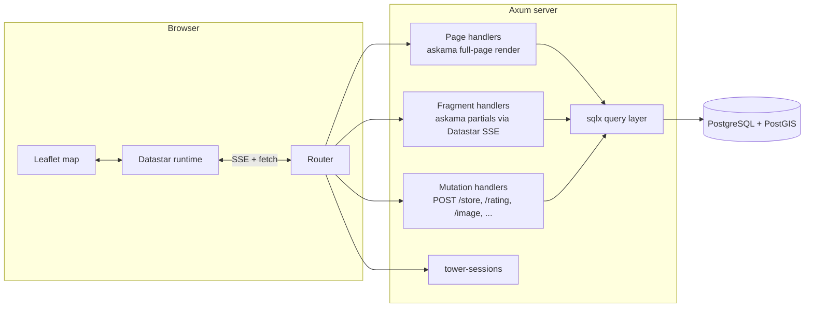
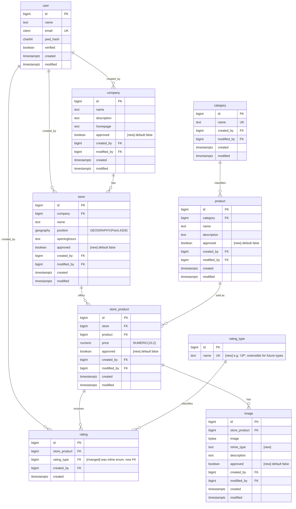
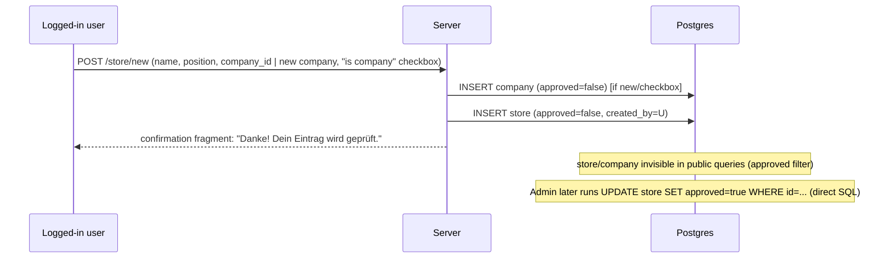

# "Was hat der Bauer" — Design Document

Online, map-first product & rating finder. Users browse a Google-Maps-style
page to find which stores carry which products, at what price, with what
rating. Logged-in users can extend the dataset (stores, companies, products,
prices, images, ratings); every user-submitted change is held for manual
approval before it becomes publicly visible.

Status: design only — nothing implemented yet. This document is the
blueprint for implementation.

---

## 1. Goals & Non-Goals

**Goals**
- Anonymous users can explore stores/products/ratings on a map, filter by
  category/product/distance, and view store detail (products, prices,
  ratings, images, opening hours, company info, Google Maps link).
- Registered users can additionally: rate a store's product (❤️ "UP" vote
  only, extensible via `rating_type`), upload images, add a product to an
  existing store (with price), and add a brand-new store (optionally
  creating its company at the same time).
- All community-submitted content is unpublished (`approved = false`) until
  an admin flips the flag directly in the database. No admin UI in v1.
- Simple, fast, server-rendered UI using Rust + Datastar — minimal client
  JS, no SPA build step.

**Non-goals (v1)**
- No admin UI (DB-direct approval).
- No password reset / email delivery (field `verified` exists but the
  verification flow is stubbed — see §9).
- No multi-language UI (German copy, hardcoded).
- No pagination of results — v1 assumes a metro-area-sized dataset returned
  per query (bounded by distance filter + bbox).

**Open assumption:** the brief's "distance in mm" is read as **km** (a
radius filter around the user's location / map center); "mm" doesn't make
sense for store search and is treated as a typo.

---

## 2. Tech Stack

| Layer | Choice | Why |
|---|---|---|
| Language | Rust | required |
| Web framework | [Axum](https://github.com/tokio-rs/axum) | async, tower ecosystem, first-class SSE (needed for Datastar), plays well with `sqlx` |
| Reactive UI | [Datastar](https://data-star.dev/) | required; hypermedia-over-SSE, tiny client runtime, no JSON API needed |
| Templating | [`askama`](https://github.com/djc/askama) | compile-time-checked HTML templates → fragments returned as Datastar `patch-elements` |
| DB | PostgreSQL + PostGIS | required (`postgis.geography`) |
| DB access | `sqlx` (Postgres, async, compile-time-checked queries) | avoids an ORM; geography handled via raw `ST_*` SQL + `sqlx::types::Json`/custom `Encode`/`Decode` for `POINT` |
| Sessions | `tower-sessions` + `tower-sessions-sqlx-store` (Postgres-backed) | simple cookie session, no hand-rolled token table |
| Password hashing | `argon2` (see §9.1 — deviates from raw sha256 in the brief, documented as a security fix) | **decided** |
| Map | [Leaflet](https://leafletjs.com/) via CDN-free vendored JS | required |
| Tiles | [basemap.at](https://basemap.at) public raster endpoint, no API key | **decided** — free for commercial use too (CC-BY 4.0 "Österreichische Verwaltung"), attribution required, see §8 |
| Image storage | Postgres `bytea` (matches `images.image: BINARY`), server-side compressed to low-hundreds-of-KB before insert | matches schema, no object storage dependency for v1 |
| Migrations | `sqlx migrate` | plain SQL files |

---

## 3. High-Level Architecture



Datastar's model: the page carries a small set of **signals** (client-side
reactive state — filters, selected store, session-derived `loggedIn` flag).
User interaction (`data-on-click`, `data-on-change`, `data-on-load`)
triggers a `@get`/`@post` to the backend; the backend streams back
`patch-elements` (replace the sidebar / navbar) and `patch-signals` (update
`$stores`, `$selectedStoreId`, …). A small vendored JS module
(`map.js`, not part of Datastar) listens for changes to the `$stores`
signal (via `data-on-signal-patch` / a `Datastar.effect` in a
`data-star-plugin`) and re-draws Leaflet markers imperatively — Leaflet's
imperative API doesn't map cleanly onto declarative DOM patches, so marker
rendering stays in a small hand-written adapter that just reads the signal.

---

## 4. Database Schema

Base entities per the brief, with additions needed for moderation and
lookups. New/changed columns vs. `db_schema.txt` are marked **[new]**.



### 4.1 Notes on additions

- **`approved BOOLEAN NOT NULL DEFAULT false`** added to `company`, `store`,
  `product`, `store_product`, `image`. Every public read query filters
  `WHERE approved`. `category` and `rating_type` are not user-creatable in
  v1 (fixed taxonomies seeded by admin), so no flag needed. `rating` itself
  is intentionally **not** gated by approval (see below) — visible
  immediately.
- **`rating_type`** replaces the inline `score enum(UP)` so future rating
  kinds (e.g. `DOWN`, `RECOMMEND`, star levels, …) can be added as data, not
  a migration. Seeded with a single row `('UP')` for v1. The app only ever
  renders `UP` today, as a ❤️ with the count next to it (e.g. `10 ❤️`) — see
  §6.2.
- **`rating` uniqueness**: `UNIQUE (store_product, created_by, rating_type)`
  so a user's ❤️ on a given `rating_type` is a toggle, not a stackable
  counter. `POST /rating` upserts (`rating_type_id` defaults to the `UP`
  row's id if omitted, since it's the only type today); `DELETE` removes it
  (un-rate). No `approved` flag — ratings are visible immediately (per your
  answer, this was intentionally left out of the moderation set).
- **`user.pwd`** is renamed conceptually to a proper Argon2 hash but keeps a
  wide text column (Argon2 encoded hashes run ~90–100 chars, not 64) — see
  §9.1 for the deviation and rationale. Also added `citext` (case-insensitive)
  extension for `email` + a unique index for login lookups.
- **`store.position`**: `geography(Point, 4326)`, WGS84 lon/lat, with a
  `GIST` index (`CREATE INDEX ON store USING GIST (position);`) for
  `ST_DWithin`/`ST_Distance` queries.
- **`image.mime_type`** added — needed to serve the `bytea` back with a
  correct `Content-Type`.
- Foreign key indexes added on all `*_id`/`store_product`/`category`/etc.
  columns used in joins/filters (`store.company`, `product.category`,
  `store_product.store`, `store_product.product`, `rating.store_product`,
  `image.store_product`).
- All `created_by`/`modified_by` are `FK -> user.id`, `ON DELETE SET NULL`
  (keep content if a user account is removed).

### 4.2 Distance query shape (for reference)

```sql
select s.id, s.name, s.openinghours,
       ST_Y(s.position::geometry) as lat,
       ST_X(s.position::geometry) as lon,
       ST_Distance(s.position, ST_MakePoint($1,$2)::geography) as distance_m
from store s
where s.approved
  and ($3::bigint is null or exists (
        select 1 from store_product sp
        join product p on p.id = sp.product and p.approved and sp.approved
        where sp.store = s.id and ($3::bigint is null or p.id = $3)
          and ($4::bigint is null or p.category = $4)
      ))
  and ST_DWithin(s.position, ST_MakePoint($1,$2)::geography, $5 * 1000)
order by distance_m asc;
```

---

## 5. Backend Design

### 5.1 Project layout

```
product_finder/
├─ Cargo.toml
├─ migrations/                # sqlx migrations (0001_init.sql, ...)
├─ static/
│  ├─ leaflet/                # vendored leaflet.js + css (no CDN)
│  ├─ datastar.js             # vendored datastar runtime
│  └─ map.js                  # thin adapter: signal -> Leaflet markers
├─ templates/                 # askama .html templates (full pages + partials)
│  ├─ layout.html
│  ├─ index.html
│  ├─ partials/sidebar_search.html
│  ├─ partials/sidebar_detail.html
│  ├─ partials/store_form.html
│  ├─ partials/auth_*.html
│  └─ ...
└─ src/
   ├─ main.rs                 # router wiring
   ├─ db/                     # sqlx query modules (store.rs, product.rs, ...)
   ├─ auth/                   # session middleware, password hashing
   ├─ handlers/
   │  ├─ pages.rs             # GET / , GET /store/{id} (deep link)
   │  ├─ search.rs            # GET /api/stores, /api/filters/*
   │  ├─ store.rs             # GET/POST /store/new
   │  ├─ store_product.rs     # POST /store/{id}/product
   │  ├─ rating.rs            # POST/DELETE /rating
   │  ├─ image.rs             # POST /image, GET /image/{id}
   │  └─ account.rs           # login/logout/register/account
   └─ models.rs
```

### 5.2 Route table

| Method | Path | Auth | Returns |
|---|---|---|---|
| GET | `/` | any | full page (map shell + default search sidebar) |
| GET | `/store/{id}` | any | full page, sidebar pre-loaded to that store's detail (deep link / share URL) |
| GET | `/api/stores` | any | Datastar SSE: `patch-signals {stores: [...]}` + `patch-elements #sidebar-results` |
| GET | `/api/filters/categories` | any | `patch-elements` (`<select>` options) |
| GET | `/api/filters/products?category_id=` | any | `patch-elements` (`<select>` options, cascading) |
| GET | `/api/store/{id}` | any | `patch-elements #sidebar` → detail view fragment |
| GET | `/api/store/back` | any | `patch-elements #sidebar` → re-render last search (signals retained client-side) |
| GET | `/login`, `/register` | anon only | form fragment/page |
| POST | `/login` | anon | sets session cookie, `patch-signals {loggedIn:true}`, `patch-elements #navbar` |
| POST | `/logout` | user | clears session, refresh navbar |
| POST | `/register` | anon | creates user (`verified=false`), auto-login |
| GET/POST | `/account` | user | view/update own `name`/`email`/password |
| GET | `/store/new` | user | new-store form fragment |
| POST | `/store/new` | user | creates `company`(maybe) + `store`, both `approved=false` |
| GET | `/store/{id}/product/new` | user | add-product-to-store form |
| POST | `/store/{id}/product/new` | user | creates `product`(maybe, `approved=false`) + `store_product` (`approved=false`) |
| POST | `/rating` | user | upsert `rating` (form: `store_product_id`, `rating_type_id` optional → defaults to `UP`) |
| DELETE | `/rating/{id}` | user (owner) | remove own rating |
| POST | `/image` | user | multipart upload → `image` row, `approved=false` |
| GET | `/image/{id}` | any | raw bytes, `Content-Type` from `mime_type` (only if `approved`, or owner) |

All mutation handlers require the `tower-sessions` middleware to resolve a
logged-in `user_id`; unauthenticated POSTs return `401` and the client
redirects to `/login` (Datastar: `data-on-401` → navigate).

### 5.3 Datastar signal set (client state)

```js
{
  // filters
  categoryId: null, productId: null, distanceKm: 5,
  lat: null, lon: null,           // geolocation or map center
  // results (server-populated via patch-signals)
  stores: [],                     // [{id,name,lat,lon,topProduct,upCount,distanceM}, ...]
  // navigation
  selectedStoreId: null,
  loggedIn: false,
}
```

Filter `<select>`/slider inputs bind with `data-bind-categoryId` etc.;
`data-on-change="@get('/api/stores')"` (debounced) re-runs the search and
streams new `stores` + sidebar HTML. `map.js` subscribes to signal patches
for `stores`/`selectedStoreId` and re-renders Leaflet markers/popups —
this is the one place with imperative JS, everything else is
attribute-driven Datastar.

### 5.4 Approval workflow



Every public read (`/api/stores`, store detail, product list, image
serving) filters `approved = true`. The submitting user can still see
their own pending submissions in `/account` under "Meine Einträge (in
Prüfung)" (simple `WHERE created_by = current_user AND NOT approved`).

### 5.5 "Store is Company" flow

New-store form (`/store/new`):
- Field: **Firma** — typeahead/select over existing `company` rows.
- Checkbox: **"Dieses Geschäft ist die Firma"** — when checked, the company
  select is hidden/disabled and replaced by the store's own `name` field
  (plus optional company `description`/`homepage`). On submit, if checked,
  the server creates a `company` row reusing the store name as company
  name (and any provided description/homepage) before creating the store,
  instead of requiring `company_id`.
- Server-side validation: exactly one of `{company_id, "isCompany" checkbox}`
  must be present.

---

## 6. Frontend / UI Design

### 6.1 Layout (desktop)

```
┌───────────────────────────────────────────────────────────────────┐
│  Was hat der Bauer                                   [Login] / [👤 Max ▾] │  ← navbar
├───────────────┬───────────────────────────────────────────────────┤
│  SEARCH        │                                                   │
│  Kategorie ▾   │                                                   │
│  Produkt   ▾   │                     MAP (Leaflet)                 │
│  Umkreis ──○── │            pins with label if zoomed/wide enough: │
│  5 km          │              ┌─────────────┐                     │
│                │              │ Hofladen Mayr│                     │
│  Ergebnisse:   │              │ Kartoffeln   │                     │
│  • Hofladen X  │              │ 12 ❤️         │                     │
│    Äpfel · 1.2 km              └─────────────┘                     │
│  • Bauer Y      │                                                   │
│    Eier · 2.4km │                                                   │
├───────────────┴───────────────────────────────────────────────────┤
```

Below ~900px width the sidebar collapses to a bottom sheet / overlay over
the map (map always full-bleed), consistent with the "Google Maps" feel
requested.

### 6.2 Sidebar states (single container `#sidebar`, server-swapped)

1. **Search** (default): category select → product select (cascades on
   category) → distance slider → results list. Selecting a result or a map
   pin triggers `GET /api/store/{id}`.
2. **Detail** (after a store/product is picked):
   - "← Zurück" button (`GET /api/store/back` — restores search state) and
     `Escape` key bound globally (`data-on-keydown.window.esc`) to the same
     action.
   - Company block: name, description, homepage link.
   - Store block: name, opening hours, **"In Google Maps öffnen"** link
     (`https://www.google.com/maps/search/?api=1&query=<lat>,<lon>`).
   - Selected product highlighted; full list of the store's other products
     with price + rating shown as **`<count> ❤️`** (e.g. `10 ❤️`) — the count
     of `UP`-type ratings on that `store_product`. Rendering is generic
     over `rating_type` (grouped counts per type) even though only `UP`
     exists today, so a future second type just adds another `<count> <icon>`
     pair without a template rewrite.
   - Per-product image gallery (thumbnails, click to enlarge).
   - If `loggedIn`: ❤️ rate button (toggles the current user's `UP` rating
     on that `store_product`), "Bild hinzufügen", "Produkt hinzufügen"
     inline forms.
   - Selecting a *different* pin/product while already in detail view
     replaces the panel directly (no need to go back first) — server just
     re-renders `#sidebar` for the new id.
3. **Auth forms** (`/login`, `/register`, `/account`) reuse the same
   `#sidebar` slot so the map stays visible/interactive behind them.

### 6.3 Map pin content

Each marker is a Leaflet `divIcon`. At low zoom / narrow viewport: plain
pin. At zoom ≥ a threshold (e.g. 14) **and** viewport width ≥ ~600px: pin
grows into a small card showing store name, best-matching product name (the
filtered product, or highest-❤️ product if unfiltered), and its `UP`-rating
count as `<count> ❤️` — driven by a CSS class toggled from `map.js` based on
`window.innerWidth` and the Leaflet `zoomend` event, not from the server.

### 6.4 Navbar

- Left: "🌾 Was hat der Bauer" (brand, links to `/`).
- Right: `loggedIn` false → **Login** link (opens sidebar login form).
  `loggedIn` true → username + dropdown: **Konto bearbeiten**,
  **Neues Geschäft**, **Logout**.

---

## 7. Auth / User Management

- Registration: name, email, password (client + server validation: email
  format, password length ≥ 8). Server hashes with Argon2id, inserts
  `verified=false` (see §9.1 — verification email is out of scope for v1;
  `verified` is currently informational only and doesn't block login/writes,
  documented as a known gap).
- Login: email + password → `tower-sessions` cookie (`HttpOnly`, `Secure`,
  `SameSite=Lax`), session store table in Postgres, session carries
  `user_id`.
- Logout: destroy session.
- Account edit: change `name`/`email`; change password (requires current
  password). Same form also lists the user's pending (`NOT approved`)
  submissions for transparency.
- Anonymous users: read-only everywhere; any mutating route redirects to
  `/login`.

---

## 8. Non-Functional

- **Security**
  - Argon2id over sha256 for password storage (documented deviation, see
    §9.1).
  - CSRF: Datastar mutating requests are same-origin `fetch`; add a
    double-submit CSRF cookie checked in mutation handlers regardless.
  - Image upload: cap raw upload size (e.g. 15 MB) at the multipart layer;
    server decodes, resizes to a max dimension (e.g. 1600px), strips EXIF,
    and re-encodes to JPEG/WebP at a quality target aiming for the
    low-hundreds-of-KB range before the `bytea` insert (see §8.2). Reject
    anything that isn't a decodable raster image; allow-list source
    `image/jpeg|png|webp`.
  - Rate-limit `/login`, `/register`, `/rating`, `/image` per-IP (tower
    middleware) to blunt spam given the DB-manual-approval model.
- **Performance**
  - `GIST` index on `store.position`; bbox/`ST_DWithin` bound every query.
  - Sidebar/marker payload kept minimal (id, name, lat/lon, best product,
    rating count) — full detail only fetched on selection.
- **Geolocation & default map center** (§8.1): browser
  `navigator.geolocation` on load (`data-on-load`) sets `$lat/$lon` and
  centers the map there. If denied/unavailable, falls back to the
  geographic center of Austria, **≈ 47.5162° N, 14.5501° E** (near Bad
  Aussee, Styria — the commonly cited centroid of the country), with a
  visible "Standort nicht verfügbar" note and manual map-drag-to-search.
  Default search radius in both cases: 5 km.
- **Map tiles / attribution** (§8.3): [basemap.at](https://basemap.at) is
  free for private *and* commercial use under "Österreichische Verwaltung"
  CC-BY 4.0, no API key or registration needed. The Leaflet
  `attribution` option must render `"Datenquelle: basemap.at"` (linking to
  https://basemap.at) per the license terms — this is a hard requirement,
  not optional UI chrome. Exact XYZ URL template(s) for `L.tileLayer` are
  pulled from the official WMTS `GetCapabilities` document
  (`https://mapsneu.wien.gv.at/basemapneu/1.0.0/WMTSCapabilities.xml`) at
  implementation time, since the public docs page only linked the
  capabilities XML rather than printing a bare XYZ pattern — this is a
  ten-minute verification step before wiring the map, not a design risk.
- **Accessibility**: forms are plain server-rendered HTML (no JS required
  to submit — Datastar progressively enhances `<form>`s), keyboard
  navigable, `Esc` handled as a real `keydown` listener not just a UI
  affordance.

### 8.1 Default center rationale
Using the user's real location first (best UX, matches the "Google Maps"
mental model from the brief) and Austria's geographic centroid as the
no-permission fallback (rather than e.g. Vienna) keeps the initial view
roughly equidistant from stores nationwide instead of biased toward the
capital, which matters for a small/early dataset spread across the
country.

### 8.2 Image size target
Stored as `bytea` per your answer — no object storage in v1. Compression
target: resize to a reasonable max edge (e.g. 1600px) and re-encode
(JPEG q≈75 or WebP) so typical photos land in roughly 50–300 KB before
insert. This is done once at upload time (not per-read), so DB row size
stays small and read-path (`GET /image/{id}`) stays a simple byte stream
with no on-the-fly processing.

### 8.3 Tile endpoint verification note
Confirmed via basemap.at's own usage terms: no API key, free for
commercial use, attribution required. The concrete raster XYZ URL(s) (one
per variant: standard color, grayscale, high-DPI, overlay) will be taken
verbatim from the WMTS capabilities XML during implementation rather than
guessed here, so the design doesn't ship a possibly-stale hardcoded tile
URL.

---

## 9. Deviations from the brief (called out explicitly)

### 9.1 Password hashing
The brief specifies `pwd: CHAR(64) -- sha256`. Unsalted/single-round SHA-256
is not acceptable for password storage (trivially reversible via rainbow
tables/GPU brute force). This design stores an **Argon2id** encoded hash
instead (variable length, ~90–100 chars, includes salt + params inline) and
widens the column accordingly. **Confirmed — Argon2id it is.**

### 9.2 `verified` flag
Present in schema and column is kept, but v1 has no outbound email, so
nothing sets it beyond an initial `false`. It doesn't gate any behavior yet.
Flag for follow-up (email verification service) once real deployment is
planned.

---

## 10. Decisions Log

| # | Question | Decision |
|---|---|---|
| 1 | Argon2 vs. literal sha256 for `pwd` | **Argon2id** (§9.1) |
| 2 | Default map center when geolocation denied | **Current location first; fallback = geographic center of Austria (≈47.5162, 14.5501)**, 5 km default radius (§8.1) |
| 3 | Should `rating` be approval-gated | **No** — visible immediately; `rating_type` table introduced instead so future rating kinds (beyond `UP`/❤️) don't need a schema change (§4) |
| 4 | basemap.at access | **Public anonymous endpoint**, no key — confirmed free for commercial use, attribution ("Datenquelle: basemap.at") required (§8.3) |
| 5 | Image storage | **`bytea` in Postgres**, server-side compressed to roughly 50–300 KB per image before insert (§8.2) — no object storage in v1 |

### Still open
- Deployment target (single VM vs. containers) — doesn't block starting
  implementation, but worth deciding before the `bytea`-vs-object-storage
  tradeoff in §8.2 needs revisiting at scale.
