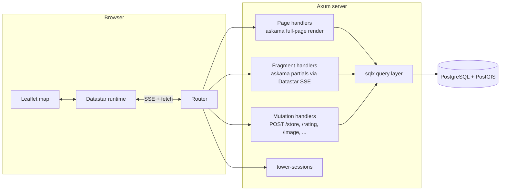
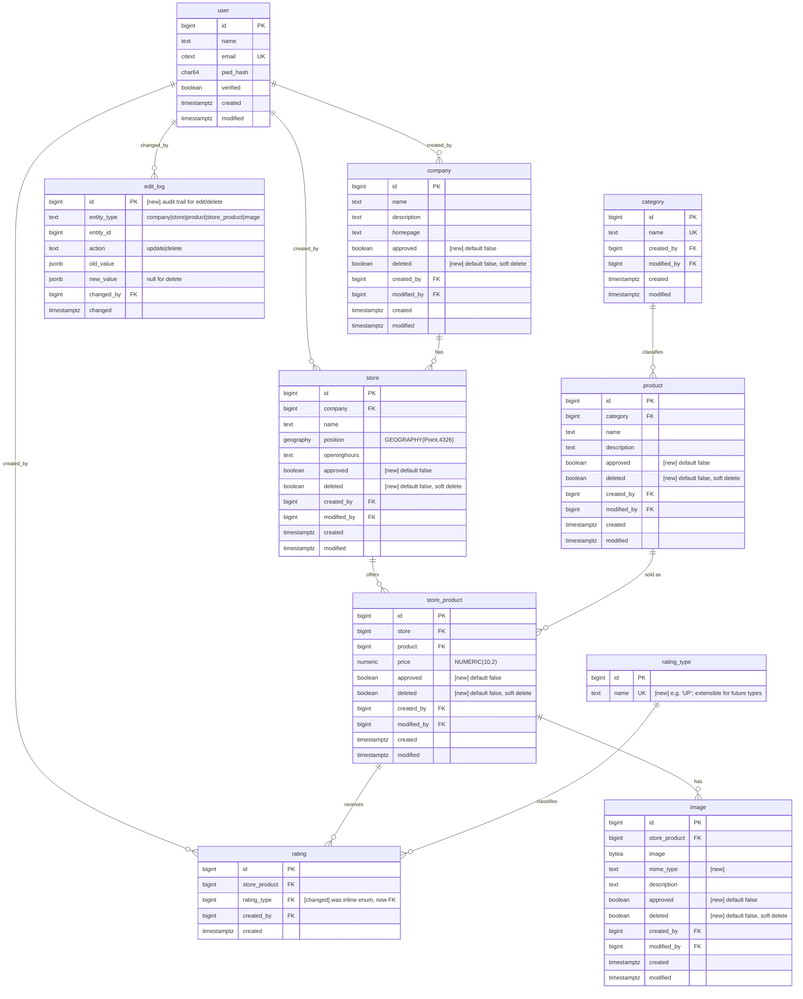
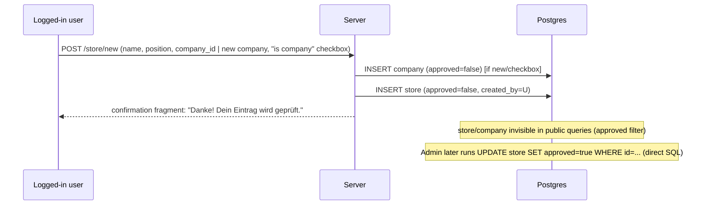

## Context

Nothing is implemented yet (see proposal.md - Why). This is a greenfield
Rust web service with a PostGIS-backed geo search, server-rendered
hypermedia UI (Datastar), and a manual (DB-direct) moderation model for
*new* community-submitted content. Editing and deleting *existing*
catalog data is explicitly not gated by that moderation model — see
"Deviations from the brief" below. The nine capabilities in proposal.md /
specs/ define *what* the system must do; this document covers *how*.

## Goals / Non-Goals

**Goals:**
- Single deployable Rust binary + Postgres, no separate API/SPA build step,
  no background job runner needed for v1.
- Every SQL query compile-time-checked (`sqlx`) and every template
  compile-time-checked (`askama`) — catch schema/markup drift at build
  time, not runtime.
- Keep the one piece of imperative client JS (Leaflet marker rendering) as
  small and isolated as possible; everything else is declarative
  Datastar attributes over server-rendered HTML.
- Moderation of *new* content is a cross-cutting `approved` flag + filter,
  not a parallel workflow engine — matches the "admin edits the DB
  directly" decision. Edits/deletes of *existing* content skip this flag
  entirely and instead rely on a generic audit log for recoverability
  (see "Editing & deletion" below) — same "no workflow engine" philosophy,
  different mechanism because there's no "before" state to protect for a
  brand-new row, but there is one for an existing row.

**Non-Goals:**
- No admin UI, no outbound email (registration verification stubbed), no
  i18n, no result pagination — see proposal.md for why; this design does
  not build hooks for any of them (e.g. no notification/email abstraction
  layer, no admin route namespace reserved).
- No object storage integration in v1 (images live in `bytea`) — see
  Risks below for the scaling trade-off this implies.

## Decisions

### Tech stack

| Layer | Choice | Why |
|---|---|---|
| Web framework | [Axum](https://github.com/tokio-rs/axum) | async, tower ecosystem, first-class SSE (needed for Datastar), plays well with `sqlx` |
| Reactive UI | [Datastar](https://data-star.dev/) | hypermedia-over-SSE, tiny client runtime, no JSON API needed |
| Templating | [`askama`](https://github.com/djc/askama) | compile-time-checked HTML templates → fragments returned as Datastar `patch-elements` |
| DB | PostgreSQL + PostGIS | `postgis.geography` for store positions and distance queries |
| DB access | `sqlx` (Postgres, async, compile-time-checked) | avoids an ORM; geography via raw `ST_*` SQL |
| Sessions | `tower-sessions` + `tower-sessions-sqlx-store` (Postgres-backed) | simple cookie session, no hand-rolled token table |
| Password hashing | `argon2` | see "Deviations from the brief" below |
| Map | [Leaflet](https://leafletjs.com/), vendored (no CDN) | required, no external JS dependency at runtime |
| Tiles | [basemap.at](https://basemap.at) public raster endpoint, no API key | free for commercial use (CC-BY 4.0 "Österreichische Verwaltung"), attribution required |
| Image storage | Postgres `bytea`, server-compressed before insert | no object storage dependency for v1 |
| Migrations | `sqlx migrate` | plain SQL files |

### Architecture



The page carries a small set of Datastar **signals** (filters, selected
store, `loggedIn`). User interaction triggers `@get`/`@post`; the backend
streams back `patch-elements` (sidebar/navbar swaps) and `patch-signals`
(`$stores`, `$selectedStoreId`, …). A vendored `map.js` adapter listens for
`$stores`/`$selectedStoreId` changes and imperatively redraws Leaflet
markers — Leaflet's imperative API doesn't map cleanly onto declarative DOM
patches, so this one adapter stays hand-written.

### Database schema

Base entities per `db_schema.txt`, with additions needed for moderation
and lookups (new/changed columns marked **[new]**):



Notes:
- `approved BOOLEAN NOT NULL DEFAULT false` added to `company`, `store`,
  `product`, `store_product`, `image` — every public read filters
  `WHERE approved` (content-moderation capability). `category` and
  `rating_type` are fixed taxonomies seeded by admin, not user-creatable,
  so no flag needed. `rating` itself is intentionally not gated (ratings
  capability).
- `rating_type` replaces an inline `score enum(UP)` so future rating kinds
  can be added as data, not a migration. Seeded with one row `('UP')`.
- `rating` uniqueness: `UNIQUE (store_product, created_by, rating_type)` —
  makes a user's rating a toggle, not a stackable counter.
- `user.pwd` becomes a wide text column holding an Argon2id encoded hash
  (~90–100 chars) instead of `CHAR(64)`; `citext` extension added for
  case-insensitive `email` + unique index.
- `store.position`: `geography(Point, 4326)`, WGS84 lon/lat, `GIST` index
  (`CREATE INDEX ON store USING GIST (position);`) for
  `ST_DWithin`/`ST_Distance`.
- `image.mime_type` added — needed to serve `bytea` back with the correct
  `Content-Type`.
- FK indexes added on all join/filter columns (`store.company`,
  `product.category`, `store_product.store`, `store_product.product`,
  `rating.store_product`, `image.store_product`).
- All `created_by`/`modified_by` are `FK -> user.id`, `ON DELETE SET NULL`.
- **`deleted BOOLEAN NOT NULL DEFAULT false`** added to `company`, `store`,
  `product`, `store_product`, `image` — the soft-delete flag for the
  catalog-editing capability. Every public read filters `WHERE approved
  AND NOT deleted`, i.e. the same predicate as before with one extra
  clause. `rating` has no `deleted` column: deletion of a rating is
  already a hard `DELETE` owned by the rating's creator (ratings
  capability), unrelated to catalog editing.
- **`edit_log`** (new table): one generic, append-only row per catalog
  edit or soft-delete. `entity_type`/`entity_id` identify the affected
  row (no FK — deliberately polymorphic, since a single typed FK per
  entity type would mean four near-identical log tables); `old_value`/
  `new_value` are full-row JSON snapshots (`new_value` is `null` for a
  delete). This is the only mechanism for an admin to revert a bad edit
  or restore a soft-deleted row in v1 — read via direct SQL, no in-app
  revert UI (content-moderation capability).

Reference distance query shape (search capability), with the soft-delete
filter and the 100 km cap on `$5` (`least($5, 100)`, clamped again
server-side regardless of what a client sends):

```sql
select s.id, s.name, s.openinghours,
       ST_Y(s.position::geometry) as lat,
       ST_X(s.position::geometry) as lon,
       ST_Distance(s.position, ST_MakePoint($1,$2)::geography) as distance_m
from store s
where s.approved and not s.deleted
  and ($3::bigint is null or exists (
        select 1 from store_product sp
        join product p on p.id = sp.product
          and p.approved and not p.deleted
          and sp.approved and not sp.deleted
        where sp.store = s.id and ($3::bigint is null or p.id = $3)
          and ($4::bigint is null or p.category = $4)
      ))
  and ST_DWithin(s.position, ST_MakePoint($1,$2)::geography, least($5, 100) * 1000)
order by distance_m asc;
```

### Project layout

```
product_finder/
├─ Cargo.toml
├─ migrations/                # sqlx migrations (0001_init.sql, ...)
├─ static/
│  ├─ leaflet/                # vendored leaflet.js + css (no CDN)
│  ├─ datastar.js             # vendored datastar runtime
│  └─ map.js                  # thin adapter: signal -> Leaflet markers
├─ templates/                 # askama .html templates (full pages + partials)
│  ├─ layout.html
│  ├─ index.html
│  ├─ partials/sidebar_search.html
│  ├─ partials/sidebar_detail.html
│  ├─ partials/store_form.html
│  ├─ partials/auth_*.html
│  └─ ...
└─ src/
   ├─ main.rs                 # router wiring
   ├─ db/                     # sqlx query modules (store.rs, product.rs, ...)
   ├─ auth/                   # session middleware, password hashing
   ├─ handlers/
   │  ├─ pages.rs             # GET / , GET /store/{id} (deep link)
   │  ├─ search.rs            # GET /api/stores, /api/filters/*
   │  ├─ store.rs             # GET/POST /store/new
   │  ├─ store_product.rs     # POST /store/{id}/product
   │  ├─ rating.rs            # POST/DELETE /rating
   │  ├─ image.rs             # POST /image, GET /image/{id}
   │  └─ account.rs           # login/logout/register/account
   └─ models.rs
```

### Route table

| Method | Path | Auth | Returns |
|---|---|---|---|
| GET | `/` | any | full page (map shell + default search sidebar) |
| GET | `/store/{id}` | any | full page, sidebar pre-loaded to that store's detail |
| GET | `/api/stores` | any | Datastar SSE: `patch-signals {stores: [...]}` + `patch-elements #sidebar-results` |
| GET | `/api/filters/categories` | any | `patch-elements` (`<select>` options) |
| GET | `/api/filters/products?category_id=` | any | `patch-elements` (`<select>` options, cascading) |
| GET | `/api/store/{id}` | any | `patch-elements #sidebar` → detail view fragment |
| GET | `/api/store/back` | any | `patch-elements #sidebar` → re-render last search |
| GET | `/login`, `/register` | anon only | form fragment/page |
| POST | `/login` | anon | sets session cookie, `patch-signals {loggedIn:true}`, `patch-elements #navbar` |
| POST | `/logout` | user | clears session, refresh navbar |
| POST | `/register` | anon | creates user (`verified=false`), auto-login |
| GET/POST | `/account` | user | view/update own `name`/`email`/password |
| GET | `/store/new` | user | new-store form fragment |
| POST | `/store/new` | user | creates `company`(maybe) + `store`, both `approved=false` |
| GET | `/store/{id}/product/new` | user | add-product-to-store form |
| POST | `/store/{id}/product/new` | user | creates `product`(maybe) + `store_product` (`approved=false`) |
| POST | `/rating` | user | upsert `rating` (form: `store_product_id`, `rating_type_id` optional → defaults to `UP`) |
| DELETE | `/rating/{id}` | user (owner) | remove own rating |
| POST | `/image` | user | multipart upload → `image` row, `approved=false` |
| GET | `/image/{id}` | any | raw bytes, `Content-Type` from `mime_type` (only if `approved`, or owner) |
| PATCH | `/company/{id}`, `/store/{id}`, `/product/{id}`, `/store/{store_id}/product/{id}`, `/image/{id}` | user (any) | edit any field on that row; live immediately, `approved` untouched; writes an `edit_log` entry; 404/409 if the row is `deleted` |
| DELETE | `/company/{id}`, `/store/{id}`, `/product/{id}`, `/store/{store_id}/product/{id}`, `/image/{id}` | user (any) | sets `deleted=true`; writes an `edit_log` entry; 409 if already `deleted` |

All mutation handlers require `tower-sessions` middleware to resolve a
logged-in `user_id`; unauthenticated POSTs return `401` and the client
redirects to `/login` (`data-on-401` → navigate). Unlike the other
mutation routes, the `PATCH`/`DELETE` routes above accept *any*
authenticated user, not just the row's creator (catalog-editing
capability) — and, per non-functional decisions below, are rate-limited
per-IP the same as the rest.

### Datastar signal set (client state)

```js
{
  categoryId: null, productId: null, distanceKm: 5,
  lat: null, lon: null,           // geolocation or map center
  stores: [],                     // [{id,name,lat,lon,topProduct,upCount,distanceM}, ...]
  selectedStoreId: null,
  loggedIn: false,
}
```

Filter inputs bind with `data-bind-categoryId` etc.;
`data-on-change="@get('/api/stores')"` (debounced) re-runs the search and
streams new `stores` + sidebar HTML. `map.js` subscribes to signal patches
for `stores`/`selectedStoreId` and re-renders Leaflet markers/popups.

### Approval workflow



Every public read filters `approved = true AND NOT deleted`. The
submitting user sees their own pending submissions in `/account` under
"Meine Einträge (in Prüfung)" (`WHERE created_by = current_user AND NOT
approved`).

### Editing & deletion (catalog-editing)

```mermaid
sequenceDiagram
    participant U as Any logged-in user
    participant S as Server
    participant DB as Postgres
    U->>S: PATCH /store/{id} (new field values)
    S->>DB: SELECT current row (must be approved, not deleted)
    S->>DB: INSERT edit_log (entity_type='store', action='update', old_value=<row before>, new_value=<row after>, changed_by=U)
    S->>DB: UPDATE store SET ... , modified_by=U, modified=now() (approved unchanged)
    S-->>U: updated detail fragment, live immediately
    Note over DB: no re-approval; visible to every visitor right away
    Note over DB: Admin later reverts via direct SQL against edit_log if needed
```

Delete follows the same shape but sets `deleted = true` instead of
updating fields, and `new_value` in the log entry is `null` (only
`old_value` is meaningful — there's nothing to move *to*). Restoring a
soft-deleted row is `UPDATE ... SET deleted = false WHERE id = ...`,
direct SQL, informed by the `edit_log` entry that recorded the delete.

Because any logged-in user (not just the creator) can hit these routes,
and there is no approval gate to catch a bad edit before it's public,
`edit_log` is not optional polish — it's the only recovery path. The
detail panel's edit/delete affordances (see UI layout below) are shown to
every logged-in user on every catalog entity, not just their own.

### "Store is company" flow

New-store form: **Firma** select over existing `company` rows, plus a
**"Dieses Geschäft ist die Firma"** checkbox that, when checked, hides the
company select and instead collects the store's own `name` (reused as
company name) plus optional company `description`/`homepage`. Server-side
validation enforces exactly one of `{company_id, isCompany checkbox}`.

### UI layout & sidebar states

Desktop: navbar (brand left, auth/login right) over a two-pane layout —
left sidebar (search filters + results, or detail, or auth forms), right
full-bleed Leaflet map. Below ~900px the sidebar collapses to a bottom
sheet/overlay over the always-full-bleed map.

`#sidebar` is a single server-swapped container with three states:
1. **Search** (default): category → product (cascading) → distance slider
   → results list.
2. **Detail**: back button + Escape-key binding, company block, store
   block (name, hours, Google Maps link), product list with price and
   `<count> <icon>` ratings, per-product image gallery, and — if
   `loggedIn` — rate button, "add image", "add product" inline forms, and
   an "edit"/"delete" affordance on every company/store/product/
   store-product/image field or row shown, available to any logged-in
   viewer (not gated on having created it) per the catalog-editing
   capability. Edit opens an inline form pre-filled with current values;
   submitting it or deleting updates the panel in place, live
   immediately.
3. **Auth forms** (`/login`, `/register`, `/account`) reuse the same slot
   so the map stays visible/interactive behind them.

Map markers are Leaflet `divIcon`s: plain pin at low zoom/narrow viewport;
at zoom ≥ ~14 and viewport ≥ ~600px wide, grows into a card with store
name, best-matching product, and its rating count — toggled from `map.js`
based on `window.innerWidth` and the Leaflet `zoomend` event, not the
server.

### Auth details

Registration/login/account flows per user-auth spec. Session cookie:
`HttpOnly`, `Secure`, `SameSite=Lax`, backed by a Postgres session table
via `tower-sessions-sqlx-store`. Anonymous users are read-only everywhere;
any mutating route redirects to `/login`.

### Non-functional decisions

- **CSRF**: no double-submit cookie. Session cookies are `SameSite=Lax`,
  which already withholds the cookie on a cross-site `POST`/`PATCH`/
  `DELETE` (only a top-level cross-site *GET* navigation carries it) — so
  a forged cross-site form submission can't carry the session either way.
  The invariant this depends on: **no state-changing route is ever
  reachable via GET** (enforced by route table review, task 11.2).
- **Image upload**: cap raw upload at 15 MB at the multipart layer; decode,
  resize so neither dimension exceeds 1920×1080 (Full HD), preserving
  aspect ratio, never upscaling, strip EXIF, re-encode to JPEG/WebP
  targeting low-hundreds-of-KB before the `bytea` insert. Reject anything
  not a decodable raster image; allow-list `image/jpeg|png|webp`. Peek the
  image header's declared dimensions *before* full decode and reject
  anything absurdly large, to bound memory use against a decompression
  bomb rather than trusting the post-decode resize alone.
- **Rate limiting**: `/login`, `/register`, `/rating`, `/image`, and the
  catalog `PATCH`/`DELETE` routes are all rate-limited per-IP (tower
  middleware) — edit/delete get the same treatment as creation despite
  not needing an account-abuse angle, because with no approval gate on
  edits, unthrottled access is a direct vandalism vector.
- **Performance**: `GIST` index on `store.position`; every search query
  bounded by `ST_DWithin` and a hard 100 km radius cap (clamped
  server-side regardless of client input). Sidebar/marker payload kept
  minimal (id, name, lat/lon, best product, rating count); full detail
  fetched only on selection.
- **Geolocation & default center**: resolved client-side in `map.js`
  (`navigator.geolocation`, a browser API — not a server round-trip), which
  sets `$lat/$lon` via the documented `data-bind` element-write contract.
  Fallback: geographic center of Austria, ≈47.5162° N, 14.5501° E (near
  Bad Aussee, Styria) — keeps the initial view roughly equidistant from
  stores nationwide instead of biased toward the capital, which matters
  for a small/early dataset spread across the country.
  **Revised default radius** (deviates from this design's original "5 km
  either way"): the radius control and its on-map circle only mean
  anything relative to a real fix, so they're shown — and default to
  5 km — only once geolocation has actually resolved (`$geoAvailable ===
  true`); while unresolved or denied, the radius control is hidden
  entirely and search runs at the spec's full 100 km cap instead of an
  arbitrarily-anchored 5 km around the Austria fallback. `$geoAvailable`
  is `null` (pending) until geolocation settles, then `true`/`false` —
  a third state the original design didn't have.
- **Map tiles/attribution**: [basemap.at](https://basemap.at) is free for
  private and commercial use under "Österreichische Verwaltung" CC-BY 4.0,
  no API key. The Leaflet `attribution` option must render "Datenquelle:
  basemap.at" (linking to https://basemap.at) — a hard license
  requirement. The exact XYZ URL template(s) are pulled from the WMTS
  `GetCapabilities` document
  (`https://mapsneu.wien.gv.at/basemapneu/1.0.0/WMTSCapabilities.xml`) at
  implementation time rather than guessed here.
- **Accessibility**: forms are plain server-rendered HTML (Datastar
  progressively enhances `<form>`s, no JS required to submit), keyboard
  navigable, `Esc` handled as a real `keydown` listener.

### Deviations from the brief

- **Password hashing**: the brief specifies `pwd: CHAR(64) -- sha256`.
  Unsalted/single-round SHA-256 is not acceptable for password storage
  (trivially reversible via rainbow tables/GPU brute force). This design
  stores an Argon2id encoded hash instead (variable length, ~90–100 chars,
  includes salt + params inline) and widens the column accordingly.
- **`verified` flag**: column is kept for schema compatibility, but v1 has
  no outbound email, so nothing sets it beyond an initial `false`. It does
  not gate login or writes yet — flagged for a follow-up change once an
  email-verification service is in scope.
- **Edits/deletes of existing catalog data bypass moderation entirely**:
  the brief (and this design's own Goal #1) frames the moderation model as
  "every user-submitted change is held for manual approval before it
  becomes publicly visible." That holds for *new* rows (`company`,
  `store`, `product`, `store_product`, `image` all still insert with
  `approved = false`), but by explicit decision it does **not** hold for
  edits or deletes of already-approved rows: any logged-in user can change
  or soft-delete any of those five entity types and the result is public
  immediately, with no review step. This is a real, intentional narrowing
  of the brief's approval guarantee, not an oversight — mitigated by the
  `edit_log` audit table (records every before/after value) and soft
  delete (nothing is ever unrecoverably destroyed) so an admin can revert
  or restore via direct SQL once they notice a bad change. There is no
  in-app revert/restore UI in v1 (same "no admin UI" scoping as
  approval) — see the content-moderation and catalog-editing specs.

## Risks / Trade-offs

- **[Risk]** `bytea` image storage grows the Postgres database
  unboundedly as the catalog scales, increasing backup size and query
  memory pressure. → **Mitigation**: images are pre-compressed to
  low-hundreds-of-KB at upload time; if the dataset outgrows this, a later
  change can move to object storage without touching the read-path
  contract (`GET /image/{id}` stays a byte stream).
- **[Risk]** DB-direct moderation (no admin UI) doesn't scale past a small
  number of admins/submissions. → **Mitigation**: acceptable for v1 per
  proposal scope; flagged as the natural next capability once submission
  volume grows. (Audit trail is no longer a gap here — see `edit_log`
  below.)
- **[Risk]** Any logged-in user can edit or soft-delete any catalog entity
  instantly, with no approval gate — a single bad-faith account (or one
  compromised via a weak password, given there's no email verification)
  can vandalize live, already-approved data across the whole catalog, not
  just their own submissions. → **Mitigation**: `edit_log` records
  before/after values for every edit and delete so damage is diagnosable
  and revertible via direct SQL; deletes are soft (recoverable, not
  destructive); the same per-IP rate limiting as other mutation routes
  bounds how fast one actor can do this. Residual risk accepted for v1
  per your explicit decision (see "Deviations from the brief"); a
  moderation queue for edits is the natural escalation if this proves
  insufficient in practice.
- **[Risk]** Manual moderation + no email verification means spam/bad-faith
  accounts can still submit content (it just won't go live without
  approval), and rate limiting is IP-based, which is bypassable.
  → **Mitigation**: per-IP rate limits on `/login`, `/register`,
  `/rating`, `/image` blunt casual abuse; full anti-abuse hardening is
  out of scope for v1 given the manual approval backstop.
- **[Risk]** The basemap.at XYZ tile URL is not hardcoded in this design
  (pulled from `GetCapabilities` at implementation time) — if that
  document's structure changes, tile wiring could stall implementation.
  → **Mitigation**: this is a scoped ~10-minute verification step, not an
  open architectural question; capabilities XML is stable public
  infrastructure.
- **[Risk]** Single Postgres instance holding both relational data and
  session store and image blobs is a single point of failure/scaling
  bottleneck. → **Mitigation**: acceptable for a v1 metro-area-sized
  dataset (per proposal non-goals: no pagination, bounded by distance
  filter); revisit if deployment scale grows (see Open Questions).

## Migration Plan

1. Provision Postgres with the `postgis` and `citext` extensions enabled.
2. Run `sqlx migrate` in order: base tables (`user`, `company`, `category`,
   `product`, `store`, `store_product`, `rating_type`, `rating`, `image`)
   with the `approved` and `deleted` columns, FK indexes, and the `GIST`
   index on `store.position`; then `edit_log`; then the `tower-sessions`
   session table.
3. Seed fixed taxonomies: `rating_type` gets a single `('UP')` row; initial
   `category` rows are seeded by the admin (outside the app, direct SQL)
   before any product submissions are meaningful.
4. Deploy the Axum binary pointed at the migrated database; static assets
   (Leaflet, Datastar, `map.js`) are vendored into the binary's `static/`
   dir, no separate build/deploy step.
5. Rollback: `sqlx migrate revert` per step if a migration is bad;
   since v1 has no production traffic yet, no data-preserving rollback
   procedure is needed beyond standard Postgres backups.

## Open Questions

- Deployment target (single VM vs. containers) is undecided. It doesn't
  block starting implementation, but is worth deciding before the
  `bytea`-vs-object-storage trade-off (Risks, above) needs revisiting at
  scale.
